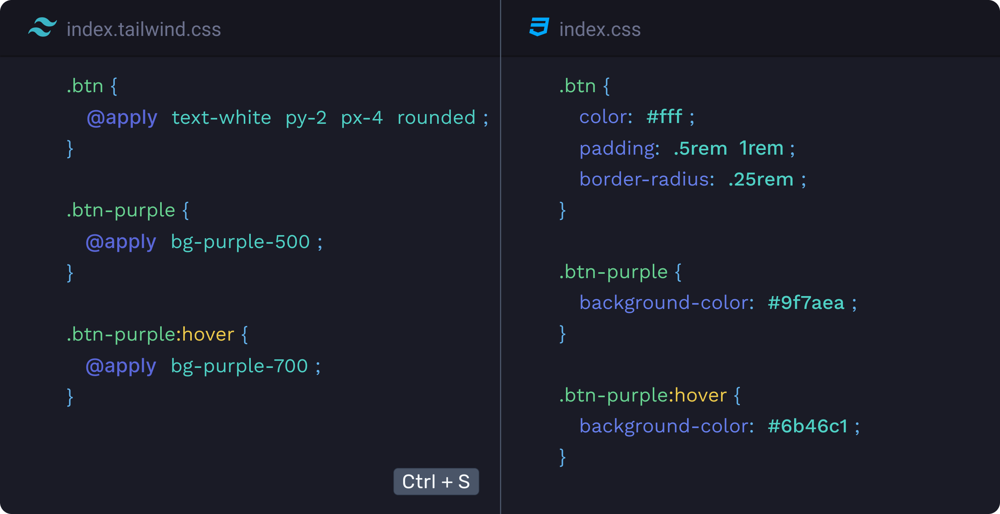
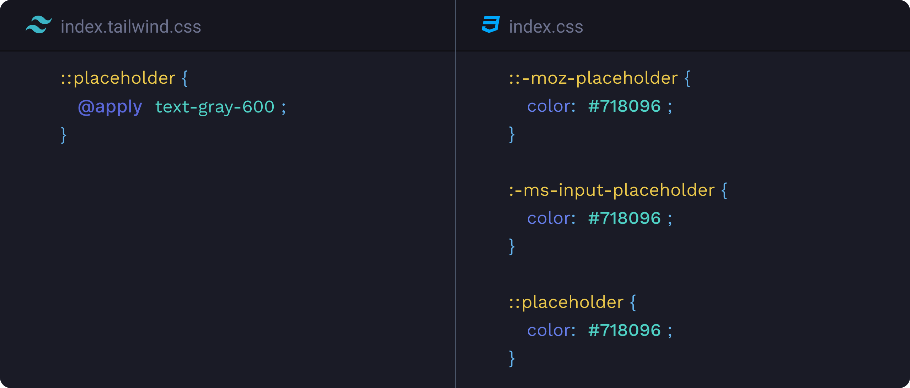
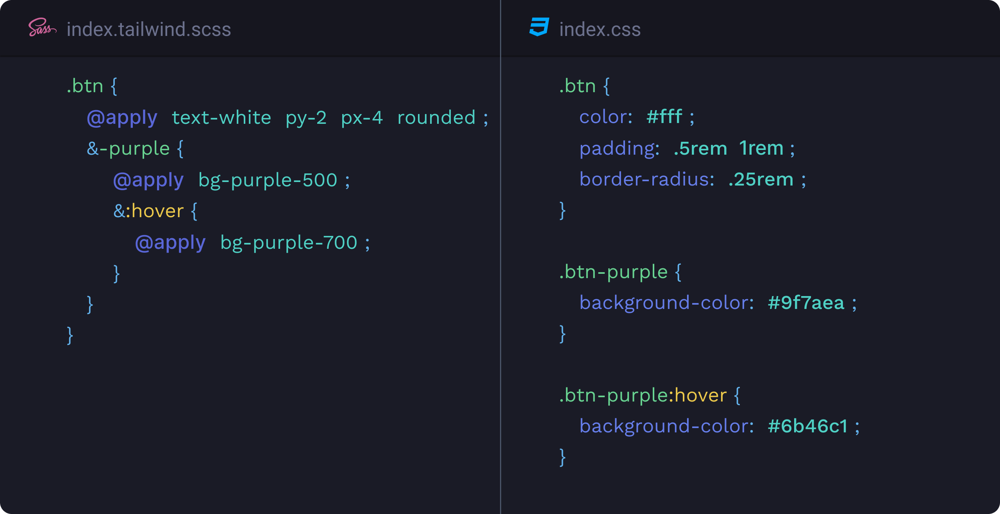
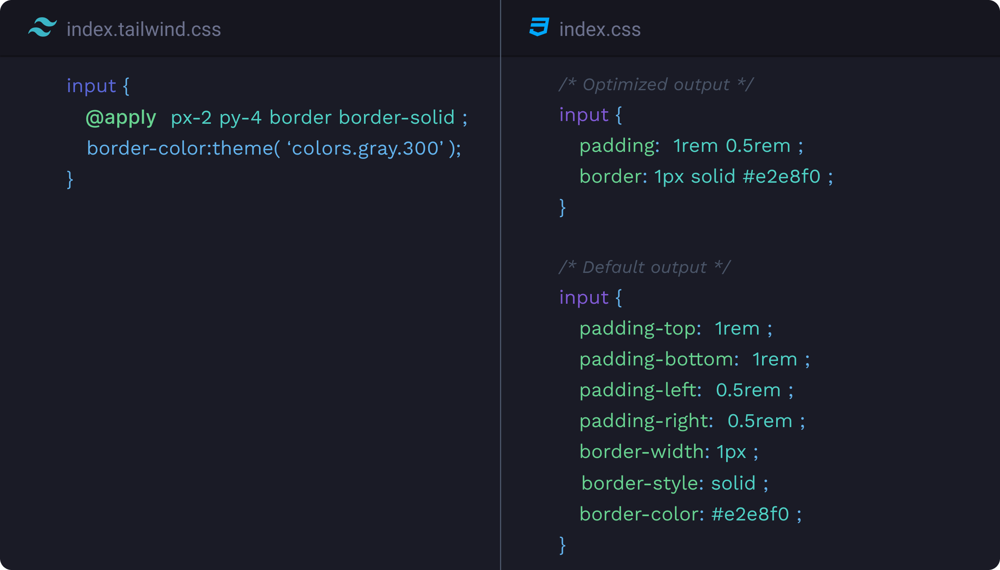

# Tailwind Transpiler

Tailwind Transpiler transpile/compile your tailwind CSS/SCSS files into pure CSS files.

## Installation

**[Install via the Visual Studio Code Marketplace →](https://marketplace.visualstudio.com/items?itemName=bradlc.vscode-tailwindcss)**

## Features

### Transpile tailwind files

Transpile tailwind CSS/SCSS files `On Save`.



### Autoprefix

Add vendor prefixes to your CSS.



### SCSS supported

Get the features provided by SCSS with `.tailwind.scss`



### Optimize CSS

Optimize CSS using [clean-css](https://github.com/jakubpawlowicz/clean-css).



## Requirements

Tailwind Transpiler works only with `.tailwind.css` or `.tailwind.scss` files.

## Settings

### `tailwindTranspiler.minifyOutputFile`

Controls whether the exported CSS should be compressed.**Default: `false`**

```json
{
  "tailwindTranspiler.minifyOutputFile": true
}
```

### `tailwindTranspiler.savePath`

The path to store transpiled CSS.**Default: `null`**
<br/>_Set the path relative from workspace root._

```json
{
  "tailwindTranspiler.savePath": "public/css"
}
```

### `tailwindTranspiler.tailwindConfigPath`

The path for tailwind configuration file. **Default: `tailwind.config.js`**
<br/>_Set the path relative from workspace root._

```json
{
  "tailwindTranspiler.tailwindConfigPath": "config/tailwind.js"
}
```

### `tailwindTranspiler.browsersList`

This setting controls the target browsers.See [Browserslist](https://github.com/browserslist/browserslist) docs for available queries. **Default:`[ "> 1%", "last 2 versions" ]`**

```json
{
  "tailwindTranspiler.browsersList": ["last 1 version", "> 1%", "ie 10"]
}
```

<br/>
<br/>
---

If you found any bug :grimacing: or if you have any suggestion :unamused:, feel free to report or suggest me :bomb: :boom:.You can contact me on [Twitter](https://twitter.com/sudoAugustin) :grinning:.

<br/>
<p style="text-align:center;">
A project by Augustin Joseph :sunglasses:
</p>
